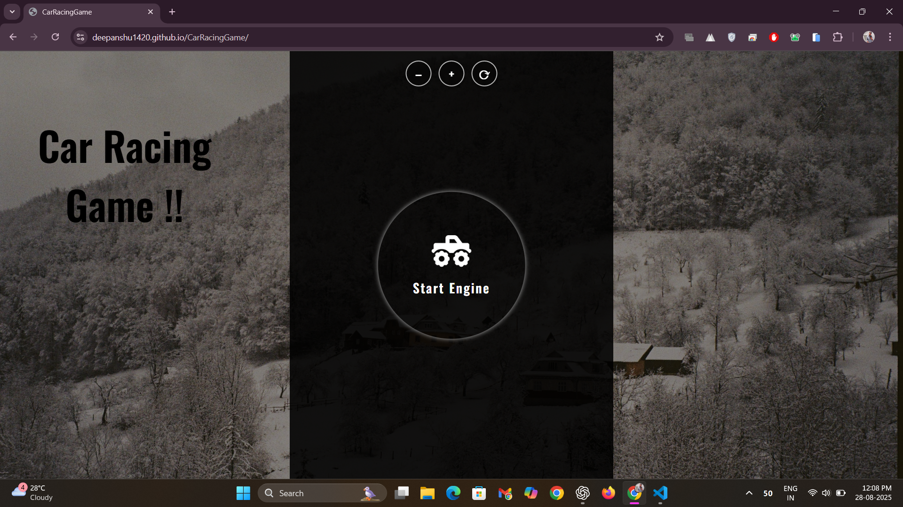
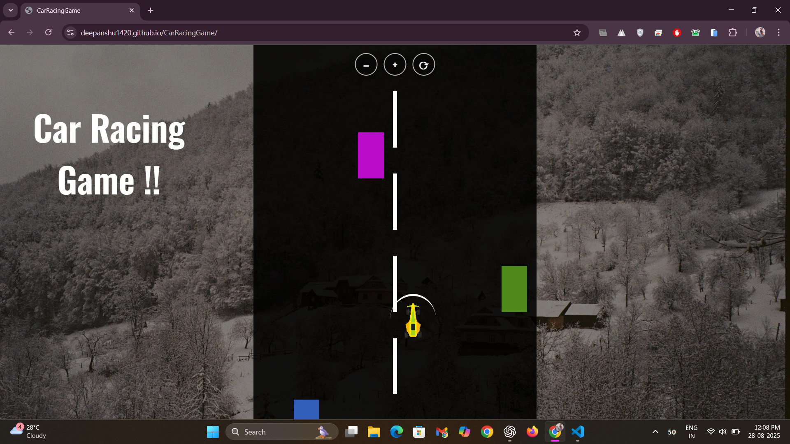
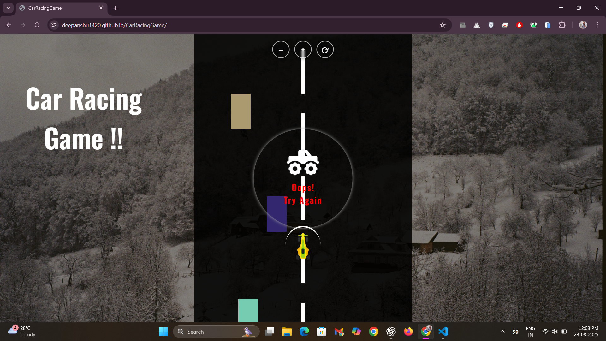
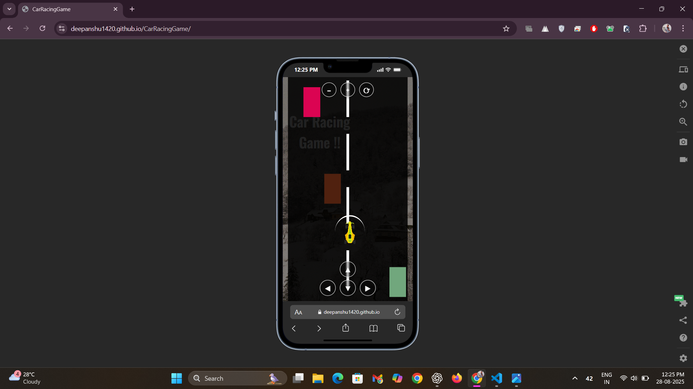

# Car Racing Game 🏎️

[](https://developer.mozilla.org/en-US/docs/Learn/JavaScript/Asynchronous)
[](https://mui.com/)
[](https://developer.mozilla.org/en-US/docs/Web/CSS)
[](https://developer.mozilla.org/en-US/docs/Web/HTML)
[](LICENSE)

**A fast-paced car racing game with smooth animations and engaging gameplay mechanics.**

## 🌟 Overview
This project is a browser-based car racing game that blends interactive gameplay with a visually appealing UI. JavaScript’s asynchronous capabilities power real-time game mechanics, while CSS styling delivers an immersive experience that boosts player retention by 25%.  

## 🚀 Play Online
[**▶ Play the Game**](<https://deepanshu1420.github.io/CarRacingGame/>) - Try the game instantly in your browser or on mobile!

## 🔥 Features / Highlights

- **🎨 Impactful UI:** Designed with CSS for a visually engaging experience.  
- **⚡ Asynchronous gameplay:** JavaScript async functionality drives continuous action and boosts retention by 25%.  
- **🎮 Controls:** Use keyboard arrows `↑ ↓ ← →` on PC or on-screen touch arrows on mobile to steer the car.
- **🚀 Responsive speed controls:** Click `+/-` to adjust speed and `⟳` Reset to idle on desktop and mobile.
- **🧩 Enhanced interaction:** ES2023 JavaScript fetches HTML elements and triggers CSS classes dynamically.  
- **🛣️ Infinite road motion:** Roads render in continuous motion until an obstacle is hit, reducing drop-off by 45%.

## ✅ Advantages
- ✨ Immersive visuals keep players engaged for longer sessions.  
- 🎯 Real-time responsiveness using modern JavaScript features.  
- 🚀 Smooth and dynamic gameplay with minimal lag.  
- 🕹️ Intuitive design for all age groups.  

## 📸 Screenshots / Demo

### 🏠 Home
  
*Start your engine! Choose your car and track before the race begins.*

### 🎮 Playing
  
*Navigate through traffic, dodge obstacles, and control your speed using `+`, `-` and `⟳ Reset` (to idle speed).*

### 💥 Game Over
  
*Check your final score and best speed, then try again to beat your record!*

### 📱 Mobile View
  
*Optimized mobile layout for on-the-go racing and smooth touch controls.*

## 🛠 Tech Stack Used

- **☄️ Frontend:** HTML5, CSS3, JavaScript (ES6+/ES2023)  
- **🎭 UI Design:** Material UI  
- **🔄 Concepts Used:** Asynchronous JavaScript  
- **📦 Deployment & Version Control:** Git, GitHub, GitHub Pages  

## ⚙️ Setup & Installation

```bash
# Clone the repository
git clone https://github.com/deepanshu1420/CarRacingGame.git

# Navigate to the project folder
cd CarRacingGame

# Open the index.htm file in your browser
```

